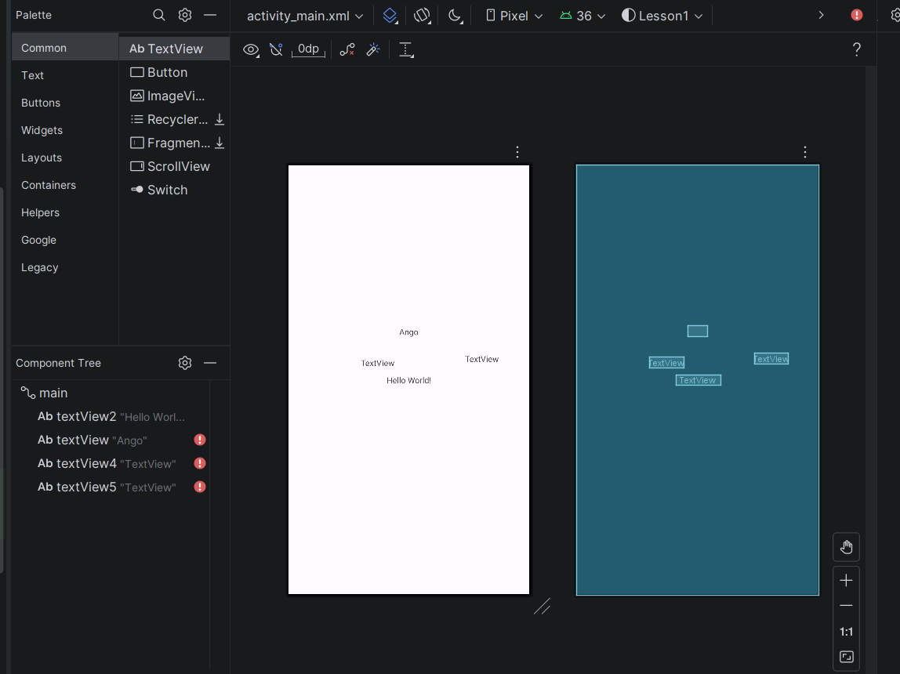
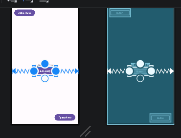
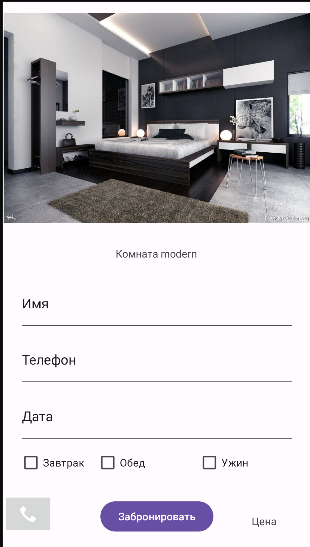
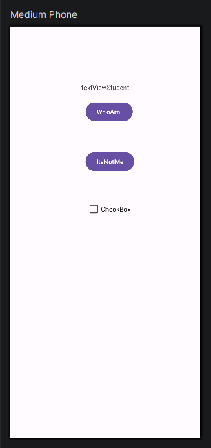

# Отчёт по практическому занятию №1
**Разработка мобильных приложений**  
**Направление:** 09.03.02 Информационные системы и технологии  
**Студент:** Ильметов Илья Владимирович  
**Группа:** БСБО-08-23
**Дата:** 10.03.26

## Цель работы
Изучить среду разработки Android Studio, структуру проекта, основные виды Layout, компоненты экрана и связь разметки с кодом Activity.

## Задачи
1. Настроить среду разработки Android Studio.
2. Создать проект и модули.
3. Изучить структуру проекта.
4. Создать эмулятор и запустить приложение.
5. Изучить компоненты экрана (View) и их свойства.
6. Освоить основные виды Layout (LinearLayout, TableLayout, ConstraintLayout).
7. Связать layout-файл с Activity.
8. Реализовать смену layout-файла и работу с ориентацией экрана.

## Ход работы

### Глава 1. Настройка среды разработки Android Studio

**1.1.** Требования к системе (Windows / macOS / Linux).

**1.2.** Импорт настроек (принято по умолчанию).

**1.3.** Завершение установки.

### Глава 2. Введение в создание приложений

**2.1.** Структура проекта (один и несколько модулей).  
**Скриншот 2.1:** Схема проекта с одним модулем  
**Скриншот 2.2:** Схема проекта с несколькими модулями

**2.2.** Создание проекта `Lesson1`.  
Параметры проекта:
- Name: `Lesson1`
- Package name: `ru.mirea.IlmetovIV.lesson1`
- Language: Java
- Minimum SDK: Android 16.0 ("Baklava")

**2.3.** Создание модуля `layouttype` (или аналогичного).

**2.4.** Структура проекта (Android View / Project View).

**2.5.** Создание эмулятора Pixel 6 (Android 17.0 CinnamonBun).

**2.6.** Запуск приложения.

### Глава 3. Компоненты экрана и их свойства

**3.1.** Открыт файл `activity_main.xml`.  


**3.2.** Добавлен и настроен TextView (изменён текст).

**3.3.** Изучены атрибуты: `android:id`, `layout_width`, `layout_height`, `text` и др.

### Глава 4. Виды Layout

#### 4.1.1 LinearLayout
Создан файл `linear_layout.xml`.

#### 4.1.2 TableLayout
Создан файл `table_layout.xml`.

#### 4.1.3 ConstraintLayout


#### 4.2. Контрольное задание — модуль `control_lesson1`


### Глава 5. Layout-файл в Activity. Смена ориентации

**5.1.** Создан файл `activity_second.xml` (PlainText + 6 кнопок).  


**5.2.** Изменён `MainActivity.java`:
```java
setContentView(R.layout.activity_second);