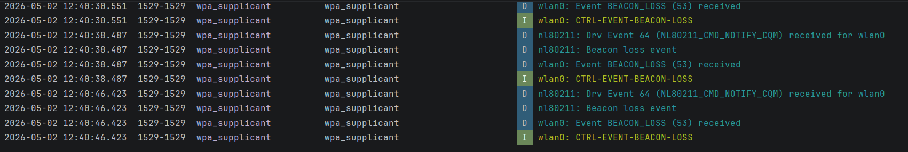
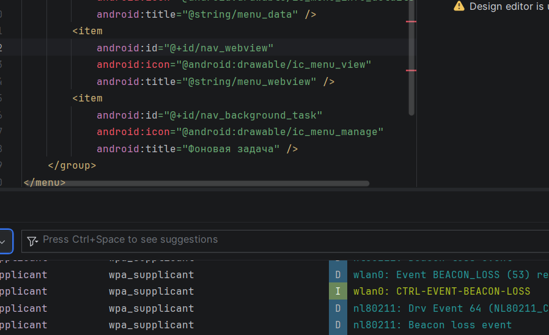

# Отчёт по практическому занятию № 4
## Разработка мобильных приложений

**РТУ МИРЭА**  
**Направление:** 09.03.02 «Информационные системы и технологии»  
**Кафедра:** КБ-14 «Цифровые технологии обработки данных»

**Студент:** Ильметов Илья Владимирович  
**Группа:** БСБО-08-23

---

## Введение

Целью практического занятия является изучение механизмов асинхронной работы в ОС Android: привязка графических компонентов с помощью View Binding, работа с потоками (Thread), передача данных между потоками через Handler и Looper, использование Loader для асинхронной загрузки данных, создание и управление Service, а также работа с WorkManager для выполнения фоновых задач.

### Основные темы занятия:
- View Binding — привязка графических компонентов
- Многопоточность в Android (Thread, Runnable)
- Передача данных между потоками (Handler, Looper, MessageQueue)
- Асинхронная загрузка данных (Loader, AsyncTaskLoader)
- Сервисы (Service) и их жизненный цикл
- WorkManager для отложенных фоновых задач

---

## Глава 1. Привязка графических компонентов (View Binding)

### 1.1 Настройка View Binding

Для использования View Binding необходимо добавить настройку в файл `build.gradle` (модуль `app`):

```groovy
android {
    ...
    buildFeatures {
        viewBinding true
    }
}
```

## 1.2 Использование View Binding в Activity
После синхронизации проекта для каждого XML-файла разметки будет сгенерирован класс Binding (например, ActivityMainBinding).

Пример кода MainActivity.java:

```java
public class MainActivity extends AppCompatActivity {
private ActivityMainBinding binding;

    @Override
    protected void onCreate(Bundle savedInstanceState) {
        super.onCreate(savedInstanceState);
        binding = ActivityMainBinding.inflate(getLayoutInflater());
        setContentView(binding.getRoot());
        
        binding.editTextMirea.setText("Мой номер по списку №7");
        binding.buttonMirea.setOnClickListener(v -> {
            Log.d(MainActivity.class.getName(), "onClickListener");
        });
    }
}
```

## 1.3 Путь до сгенерированного класса Binding
Сгенерированные классы Binding находятся в папке:

text
app/build/generated/data_binding_base_class_source_out/

### Глава 2. Потоки (Thread) в Android
2.1 Создание модуля thread
Создан новый модуль thread с использованием Empty Activity.

2.2 Разметка activity_main.xml
На экране размещены элементы Button и TextView. Инициализация через Binding.

Разметка:

```xml
<LinearLayout xmlns:android="http://schemas.android.com/apk/res/android"
android:layout_width="match_parent"
android:layout_height="match_parent"
android:orientation="vertical"
android:padding="16dp">

    <TextView
        android:id="@+id/textViewInfo"
        android:layout_width="wrap_content"
        android:layout_height="wrap_content"
        android:text="Информация о потоке"
        android:textSize="16sp"/>

    <EditText
        android:id="@+id/editTextTotalPairs"
        android:layout_width="match_parent"
        android:layout_height="wrap_content"
        android:hint="Общее количество пар"/>

    <EditText
        android:id="@+id/editTextStudyDays"
        android:layout_width="match_parent"
        android:layout_height="wrap_content"
        android:hint="Количество учебных дней"/>

    <Button
        android:id="@+id/buttonCalculate"
        android:layout_width="wrap_content"
        android:layout_height="wrap_content"
        android:text="Рассчитать среднее"/>

    <TextView
        android:id="@+id/textViewResult"
        android:layout_width="wrap_content"
        android:layout_height="wrap_content"
        android:text="Результат: "
        android:textSize="16sp"/>

</LinearLayout>
```

2.3 Информация о главном потоке
Для получения информации о главном потоке и изменения его имени:

```java
Thread mainThread = Thread.currentThread();
Log.d("MainThread", "Имя потока: " + mainThread.getName());
Log.d("MainThread", "Приоритет: " + mainThread.getPriority());
mainThread.setName("MY_MAIN_THREAD");
Log.d("MainThread", "Новое имя: " + mainThread.getName());
```

*Где найти: запустить приложение и посмотреть в Logcat (Alt+6)*

2.4 Имитация долгой операции в главном потоке
Для демонстрации проблемы блокировки UI-потока:

```java
binding.buttonCalculate.setOnClickListener(v -> {
long endTime = System.currentTimeMillis() + 20 * 1000;
while (System.currentTimeMillis() < endTime) {
synchronized (this) {
try {
wait(endTime - System.currentTimeMillis());
} catch (Exception e) {
throw new RuntimeException(e);
}
}
}
});
```

2.5 Создание фонового потока через Runnable
Для выполнения долгих операций в фоновом потоке:

```java
Runnable backgroundTask = new Runnable() {
@Override
public void run() {
// Вычисление среднего количества пар
String totalPairsStr = binding.editTextTotalPairs.getText().toString();
String studyDaysStr = binding.editTextStudyDays.getText().toString();

        if (!totalPairsStr.isEmpty() && !studyDaysStr.isEmpty()) {
            int totalPairs = Integer.parseInt(totalPairsStr);
            int studyDays = Integer.parseInt(studyDaysStr);
            double average = (double) totalPairs / studyDays;
            
            // Обновление UI (требуется runOnUiThread)
            runOnUiThread(() -> {
                binding.textViewResult.setText("Среднее пар в день: " + String.format("%.2f", average));
            });
        }
    }
};

binding.buttonCalculate.setOnClickListener(v -> {
Thread thread = new Thread(backgroundTask);
thread.start();
});
```

2.6 Логирование потоков в Logcat


## Глава 3. Передача данных между потоками
3.1 Модуль data_thread (runOnUiThread, post, postDelayed)
Создан модуль data_thread для демонстрации методов передачи данных в UI-поток.

3.2 Пример использования методов
```java
public class MainActivity extends AppCompatActivity {
private ActivityMainBinding binding;
private TextView textViewLog;

    @Override
    protected void onCreate(Bundle savedInstanceState) {
        super.onCreate(savedInstanceState);
        binding = ActivityMainBinding.inflate(getLayoutInflater());
        setContentView(binding.getRoot());
        
        textViewLog = binding.textViewLog;
        textViewLog.setMaxLines(10);
        textViewLog.setLines(10);

        // runOnUiThread
        new Thread(() -> {
            runOnUiThread(() -> {
                appendLog("runOnUiThread: выполняется в UI потоке");
            });
        }).start();

        // post
        binding.getRoot().post(() -> {
            appendLog("post: выполняется в UI потоке");
        });

        // postDelayed
        binding.getRoot().postDelayed(() -> {
            appendLog("postDelayed: выполняется в UI потоке через 2 секунды");
        }, 2000);
    }

    private void appendLog(String message) {
        String currentText = textViewLog.getText().toString();
        textViewLog.setText(currentText + "\n" + message);
    }
}
```

3.3 Модуль looper (Handler + Looper)
Создан модуль looper для демонстрации очереди сообщений между потоками.

Класс MyLooper.java:

```java
public class MyLooper extends Thread {
public Handler mHandler;
private Handler mainThreadHandler;

    public MyLooper(Handler mainThreadHandler) {
        this.mainThreadHandler = mainThreadHandler;
    }

    @Override
    public void run() {
        Looper.prepare();
        mHandler = new Handler(Looper.myLooper()) {
            @Override
            public void handleMessage(Message msg) {
                Bundle bundle = msg.getData();
                String data = bundle.getString("KEY");
                
                // Отправляем результат обратно в UI-поток
                Message resultMsg = Message.obtain();
                Bundle resultBundle = new Bundle();
                resultBundle.putString("result", "Обработано: " + data);
                resultMsg.setData(resultBundle);
                mainThreadHandler.sendMessage(resultMsg);
            }
        };
        Looper.loop();
    }
}
Код в MainActivity.java:

java
public class MainActivity extends AppCompatActivity {
private ActivityMainBinding binding;

    @Override
    protected void onCreate(Bundle savedInstanceState) {
        super.onCreate(savedInstanceState);
        binding = ActivityMainBinding.inflate(getLayoutInflater());
        setContentView(binding.getRoot());
        
        Handler mainThreadHandler = new Handler(Looper.getMainLooper()) {
            @Override
            public void handleMessage(Message msg) {
                String result = msg.getData().getString("result");
                Log.d("MainActivity", "Результат: " + result);
                binding.textViewResult.setText(result);
            }
        };
        
        MyLooper myLooper = new MyLooper(mainThreadHandler);
        myLooper.start();
        
        binding.buttonSend.setOnClickListener(v -> {
            Message msg = Message.obtain();
            Bundle bundle = new Bundle();
            bundle.putString("KEY", binding.editTextInput.getText().toString());
            msg.setData(bundle);
            myLooper.mHandler.sendMessage(msg);
        });
    }
}
```

3.4 Модуль CryptoLoader (шифрование AES)
Создан модуль CryptoLoader для демонстрации асинхронной загрузки с шифрованием.

Класс MyLoader.java:

```java
public class MyLoader extends AsyncTaskLoader<String> {
public static final String ARG_WORD = "ARG_WORD";
private String mWord;
private byte[] mKeyBytes;

    public MyLoader(@NonNull Context context, @Nullable Bundle args) {
        super(context);
        if (args != null) {
            mWord = args.getString(ARG_WORD);
            mKeyBytes = args.getByteArray("key");
        }
    }

    @Override
    public String loadInBackground() {
        try {
            Thread.sleep(5000); // Имитация загрузки
            SecretKey originalKey = new SecretKeySpec(mKeyBytes, 0, mKeyBytes.length, "AES");
            return decryptMsg(mWord.getBytes(), originalKey);
        } catch (Exception e) {
            return "Ошибка: " + e.getMessage();
        }
    }

    public static String decryptMsg(byte[] cipherText, SecretKey secret) {
        try {
            Cipher cipher = Cipher.getInstance("AES");
            cipher.init(Cipher.DECRYPT_MODE, secret);
            return new String(cipher.doFinal(cipherText));
        } catch (Exception e) {
            throw new RuntimeException(e);
        }
    }

    @Override
    protected void onStartLoading() {
        super.onStartLoading();
        forceLoad();
    }
}
```
Код в MainActivity.java:

```java
public class MainActivity extends AppCompatActivity implements LoaderManager.LoaderCallbacks<String> {
private ActivityMainBinding binding;
private final int LoaderID = 1234;
private SecretKey secretKey;

    @Override
    protected void onCreate(Bundle savedInstanceState) {
        super.onCreate(savedInstanceState);
        binding = ActivityMainBinding.inflate(getLayoutInflater());
        setContentView(binding.getRoot());
        
        try {
            secretKey = generateKey();
        } catch (Exception e) {
            e.printStackTrace();
        }
        
        binding.buttonEncrypt.setOnClickListener(v -> {
            String inputText = binding.editTextInput.getText().toString();
            byte[] encryptedData = encryptMsg(inputText, secretKey);
            
            Bundle bundle = new Bundle();
            bundle.putByteArray(MyLoader.ARG_WORD, encryptedData);
            bundle.putByteArray("key", secretKey.getEncoded());
            
            LoaderManager.getInstance(this).initLoader(LoaderID, bundle, this);
        });
    }
    
    @NonNull
    @Override
    public Loader<String> onCreateLoader(int id, @Nullable Bundle args) {
        if (id == LoaderID) {
            Toast.makeText(this, "onCreateLoader: загрузка начата", Toast.LENGTH_SHORT).show();
            return new MyLoader(this, args);
        }
        throw new InvalidParameterException("Invalid loader id");
    }
    
    @Override
    public void onLoadFinished(@NonNull Loader<String> loader, String data) {
        Toast.makeText(this, "Расшифрованная фраза: " + data, Toast.LENGTH_LONG).show();
        binding.textViewResult.setText("Результат: " + data);
    }
    
    @Override
    public void onLoaderReset(@NonNull Loader<String> loader) {}
}
```

Глава 4. Сервисы (Services)
4.1 Создание модуля ServiceApp
Создан модуль ServiceApp с музыкальным плеером на основе Service.

4.2 Добавление медиафайла
Создана папка res/raw и добавлен MP3-файл.

4.3 Создание класса PlayerService

Код PlayerService.java:

```java
public class PlayerService extends Service {
private MediaPlayer mediaPlayer;
public static final String CHANNEL_ID = "ForegroundServiceChannel";

    @Override
    public IBinder onBind(Intent intent) {
        return null;
    }

    @Override
    public int onStartCommand(Intent intent, int flags, int startId) {
        mediaPlayer.start();
        mediaPlayer.setOnCompletionListener(mp -> stopForeground(true));
        return START_STICKY;
    }

    @Override
    public void onCreate() {
        super.onCreate();
        
        // Создание уведомления для foreground service
        NotificationCompat.Builder builder = new NotificationCompat.Builder(this, CHANNEL_ID)
                .setContentText("Playing...")
                .setSmallIcon(R.mipmap.ic_launcher)
                .setPriority(NotificationCompat.PRIORITY_HIGH);
        
        NotificationChannel channel = new NotificationChannel(CHANNEL_ID, "Music Player Channel", 
                NotificationManager.IMPORTANCE_DEFAULT);
        NotificationManagerCompat.from(this).createNotificationChannel(channel);
        
        startForeground(1, builder.build());
        
        mediaPlayer = MediaPlayer.create(this, R.raw.music);
        mediaPlayer.setLooping(false);
    }

    @Override
    public void onDestroy() {
        stopForeground(true);
        if (mediaPlayer != null) {
            mediaPlayer.stop();
            mediaPlayer.release();
        }
        super.onDestroy();
    }
}
```
4.4 Регистрация сервиса в манифесте
```xml
<service
android:name=".PlayerService"
android:enabled="true"
android:exported="true" />
```

4.5 Разрешения
```xml
<uses-permission android:name="android.permission.FOREGROUND_SERVICE" />
<uses-permission android:name="android.permission.POST_NOTIFICATIONS" />
```

4.6 Код MainActivity
```java
public class MainActivity extends AppCompatActivity {
private ActivityMainBinding binding;
private final int PermissionCode = 200;

    @Override
    protected void onCreate(Bundle savedInstanceState) {
        super.onCreate(savedInstanceState);
        binding = ActivityMainBinding.inflate(getLayoutInflater());
        setContentView(binding.getRoot());
        
        // Проверка разрешений
        if (ContextCompat.checkSelfPermission(this, Manifest.permission.POST_NOTIFICATIONS) 
                != PackageManager.PERMISSION_GRANTED) {
            ActivityCompat.requestPermissions(this, 
                new String[]{Manifest.permission.POST_NOTIFICATIONS, 
                             Manifest.permission.FOREGROUND_SERVICE}, PermissionCode);
        }
        
        binding.buttonPlay.setOnClickListener(v -> {
            Intent serviceIntent = new Intent(MainActivity.this, PlayerService.class);
            ContextCompat.startForegroundService(MainActivity.this, serviceIntent);
        });
        
        binding.buttonStop.setOnClickListener(v -> {
            stopService(new Intent(MainActivity.this, PlayerService.class));
        });
    }
}
```

## Глава 5. WorkManager
5.1 Создание модуля WorkManager
Создан модуль WorkManager для демонстрации отложенных фоновых задач.

5.2 Добавление зависимости
В build.gradle (Module :workmanager) добавить:

```groovy
dependencies {
implementation 'androidx.work:work-runtime:2.8.1'
}
```

5.3 Создание класса UploadWorker
```java
public class UploadWorker extends Worker {
static final String TAG = "UploadWorker";

    public UploadWorker(@NonNull Context context, @NonNull WorkerParameters params) {
        super(context, params);
    }
    
    @Override
    public Result doWork() {
        Log.d(TAG, "doWork: start");
        try {
            TimeUnit.SECONDS.sleep(10);
        } catch (InterruptedException e) {
            e.printStackTrace();
            return Result.failure();
        }
        Log.d(TAG, "doWork: end");
        return Result.success();
    }
}
```

5.4 Запуск Worker с ограничениями
```java
public class MainActivity extends AppCompatActivity {
private ActivityMainBinding binding;

    @Override
    protected void onCreate(Bundle savedInstanceState) {
        super.onCreate(savedInstanceState);
        binding = ActivityMainBinding.inflate(getLayoutInflater());
        setContentView(binding.getRoot());
        
        Constraints constraints = new Constraints.Builder()
                .setRequiredNetworkType(NetworkType.UNMETERED)
                .setRequiresCharging(true)
                .build();
        
        OneTimeWorkRequest uploadWorkRequest = new OneTimeWorkRequest.Builder(UploadWorker.class)
                .setConstraints(constraints)
                .build();
        
        binding.buttonStartWork.setOnClickListener(v -> {
            WorkManager.getInstance(this).enqueue(uploadWorkRequest);
            Toast.makeText(this, "Задача поставлена в очередь", Toast.LENGTH_SHORT).show();
        });
    }
}
```

Глава 6. Контрольное задание (MireaProject)
В проекте MireaProject создан отдельный фрагмент для выполнения фоновой задачи.



Выводы
В ходе практического занятия № 4 были выполнены следующие задачи:

Освоенные темы:
View Binding:

Настройка и использование View Binding в Activity и Fragment

Доступ к элементам разметки без findViewById

Null и Type safety

Многопоточность (Thread):

Получение информации о главном потоке

Изменение имени и приоритета потока

Создание фоновых потоков через Runnable

Проблема ANR и её решение

Передача данных между потоками:

Методы runOnUiThread, post, postDelayed

Создание очереди сообщений через Handler + Looper

Асинхронная загрузка данных через Loader

Шифрование и дешифрование AES в фоновом потоке

Сервисы (Service):

Создание и регистрация Service

Жизненный цикл Service

Foreground Service с уведомлением

Воспроизведение музыки в фоне

WorkManager:

Настройка WorkManager

Создание Worker с фоновой задачей

Добавление ограничений (Constraints)

Постановка задач в очередь